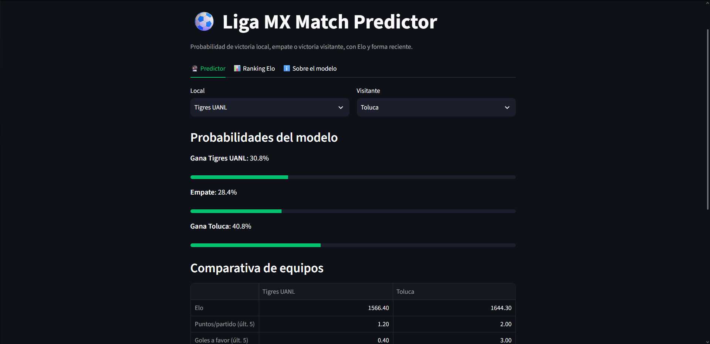

# ⚽ ligamx-match-predictor



Predictor de resultados de partidos de la **Liga MX** (gana local, empate o gana visitante) usando Elo y forma reciente, comparado contra las probabilidades implícitas de los momios del mercado. Incluye un dashboard en Streamlit.

> **Resultado principal:** los modelos simples le ganan a no saber nada, pero **ninguno supera al mercado**. Agregar mis features encima de los momios tampoco mejora. Abajo explico por qué.

## Resultados

Evaluación sobre partidos que el modelo nunca vio (temporadas 2023/24 a 2025/26, 1,016 partidos). En log loss, **menor es mejor**.

| Modelo | Log loss | Accuracy |
|---|---|---|
| Mercado (momios promedio) | 0.9809 | 52.9% |
| Regresión logística + momios | 0.9879 | 52.0% |
| Regresión logística (Elo + forma) | 1.0090 | 50.5% |
| XGBoost (Elo + forma) | 1.0213 | 50.2% |
| Frecuencias históricas (baseline) | 1.0599 | 47.1% |

**Cómo leerlo:**

- Las frecuencias históricas siempre predicen 44.6% local, 27.1% empate y 28.3% visitante. Es el piso: un modelo que no lo supera no aprendió nada.
- Mis dos modelos sí lo superan, así que Elo y forma reciente aportan señal.
- Los momios se llevan el primer lugar. Ya incorporan lesiones, alineaciones y mucha más información que la que tengo.
- Meter Elo y forma junto con los momios no mejora nada: esa información pública el mercado ya la tiene.
- La diferencia entre logística y XGBoost (~0.012) está dentro del ruido con 1,016 partidos de prueba.

## Datos

- Resultados y momios de [football-data.co.uk](https://football-data.co.uk/mexico.php) (`MEX.csv`): 4,743 partidos de 2012/13 a 2026/27 (torneo en curso).
- Baseline del mercado: promedio de momios de cierre (`AvgCH`, `AvgCD`, `AvgCA`), convertidos a probabilidades quitando el margen de la casa. Es la única fuente de momios completa para todos los partidos.
- El CSV no trae tiros ni posesión. Eso es bueno: esas estadísticas solo se conocen después del partido y serían fuga de datos.

## Metodología

- **Elo:** todos los equipos inician en 1500 y el rating se actualiza después de cada partido (K = 20, ventaja de local = 60).
- **Forma reciente:** puntos, goles a favor y goles en contra de los últimos 5 partidos, calculados solo con partidos anteriores.
- **Validación temporal:** entrenamiento 2013/14 a 2022/23, prueba 2023/24 a 2025/26. La temporada 2012/13 solo calienta el Elo y la 2026/27, al estar en curso, queda fuera. Nunca se mezclan partidos del futuro con el pasado.
- **Afinación del Elo:** rejilla de 48 combinaciones (K, ventaja de local, regresión a la media entre torneos) validada en 2021/22 y 2022/23. Las diferencias entre las mejores fueron de ~0.0004 en log loss, o sea ruido, así que se conservaron los valores originales.

## Limitaciones

- No hay datos de lesiones, alineaciones ni calendario. Por eso no se puede esperar superar al mercado.
- La temporada 2019/20 está incompleta (el Clausura 2020 se canceló por COVID).
- Los torneos cortos (17 jornadas) hacen que la forma reciente sea ruidosa.
- El modelo del dashboard se entrena con todos los partidos disponibles. Las métricas de la tabla vienen de la evaluación con split temporal, no del modelo final.
- Es un proyecto educativo, **no** una recomendación de apuestas.

## Cómo correrlo

Solo la app (el modelo ya viene en el repo):

```bash
git clone https://github.com/luismtz224/ligamx-match-predictor.git
cd ligamx-match-predictor
python -m venv .venv
source .venv/Scripts/activate   # Windows con Git Bash. En Linux/macOS: source .venv/bin/activate
pip install -r requirements.txt
streamlit run app.py
```

Para la app basta `requirements.txt`. Para el notebook, reentrenar el modelo y las pruebas, instala `requirements-dev.txt` (incluye al anterior):

```bash
pip install -r requirements-dev.txt
python -m src.entrenar   # imprime la tabla de métricas y regenera modelos/modelo.joblib
python -m pytest -q      # pruebas de Elo, forma y no-fuga de datos
```

El CSV ya viene en `datos/crudos/`. Si quieres actualizarlo con los partidos más recientes, descarga [MEX.csv](https://football-data.co.uk/new/MEX.csv) y reemplázalo (si `curl` da error de certificado, bájalo desde el navegador). El análisis completo está en `cuadernos/01_exploracion.ipynb`.

## Estructura

```
├── app.py                  # dashboard de Streamlit
├── cuadernos/
│   └── 01_exploracion.ipynb  # datos, features, modelos y evaluación
├── datos/
│   ├── crudos/             # MEX.csv original
│   └── procesados/         # partidos con features (no se sube)
├── modelos/modelo.joblib   # modelo entrenado
├── src/                    # features.py (Elo y forma) y entrenar.py
├── tests/                  # pruebas de features y no-fuga
├── requirements.txt        # solo lo que necesita la app
└── requirements-dev.txt    # notebook, entrenamiento y pruebas
```

## Stack

Python, pandas, scikit-learn, XGBoost (solo para entrenamiento y comparación), Streamlit.

## Autor

Luis ([@luismtz224](https://github.com/luismtz224)). Licencia MIT.
