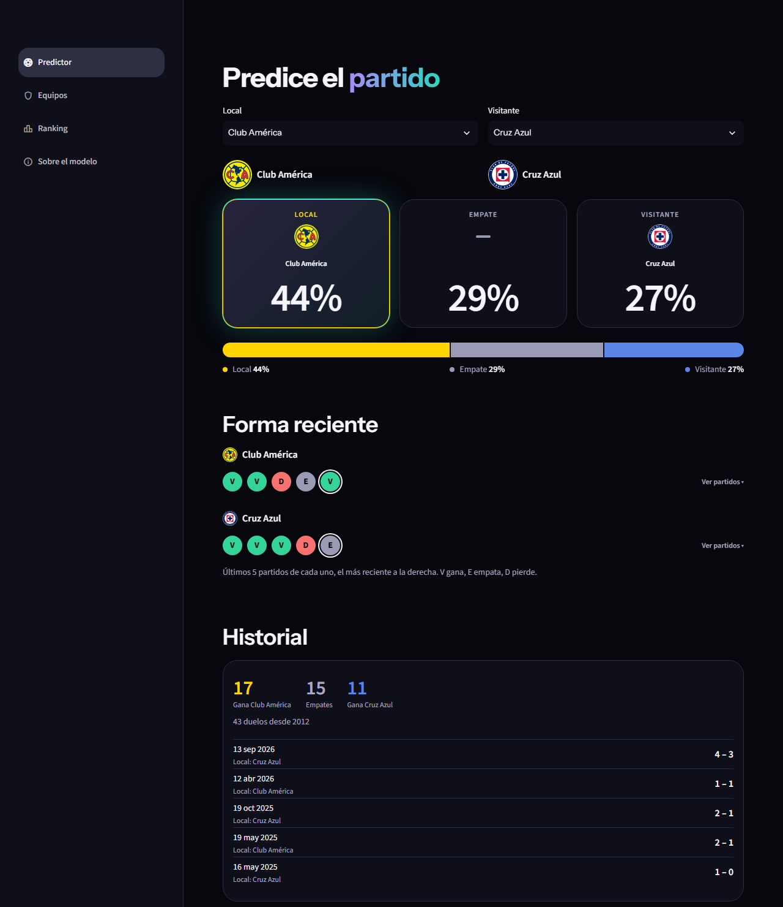
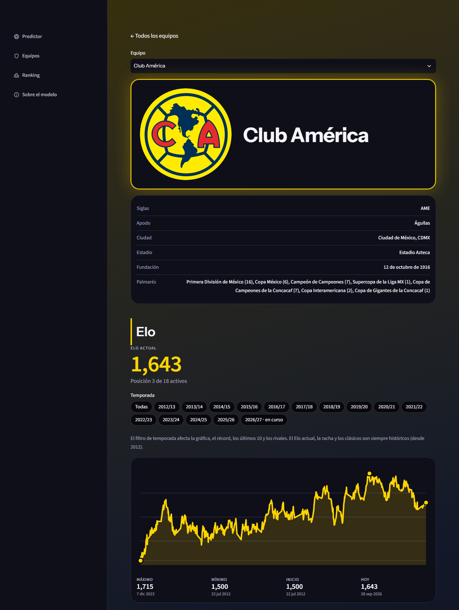
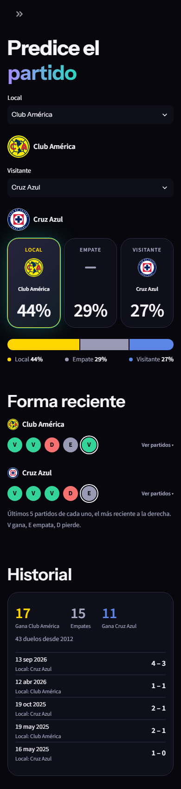
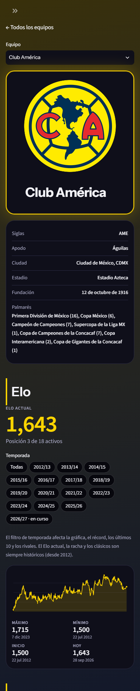

# ⚽ ligamx-match-predictor

<p align="center">
  
  
</p>
<p align="center">
  
  
</p>

Realicé este modelo que calcula la probabilidad de los resultados de los partidos de la Liga MX y lo comparé con los pronósticos de las casas de apuestas para ver qué tan bueno es en realidad.

**Demo:** [ligamx.streamlit.app](https://ligamx.streamlit.app)

## Resultado

Probé el modelo en 8 temporadas (de la 2018/19 a la 2025/26, con 2,651 partidos en total). Es mejor que adivinar a ciegas, aunque los momios de las casas de apuestas siguen siendo más efectivos. Agregarle mis datos a los momios tampoco ayuda: de hecho, los empeora un poco.

Log loss (pérdida logarítmica):

| Modelo | Log loss | Accuracy |
|---|---|---|
| Momios (casas de apuestas) | 1.0037 | 50.85% |
| Regresión logística (mi modelo) | 1.0281 | 49.30% |
| XGBoost | 1.0474 | 47.98% |
| Sin modelo (siempre el mismo porcentaje) | 1.0670 | 45.61% |

> La fila "Sin modelo" dice siempre los mismos porcentajes en todos los partidos (los promedios históricos de local, empate y visitante). Sirve de piso: si un modelo no le gana a eso, no aprendió nada.

El log loss es básicamente la calificación de mi modelo: entre más bajo, mejor. Si el modelo dice 90% y falla, el castigo es grande y el log loss sube mucho; si dice 50% y falla, el castigo es mucho menor porque el error es leve.

## Aprendizajes y limitaciones

- El modelo sencillo de regresión logística le ganó al complicado XGBoost: quedó mejor en 6 de las 8 temporadas. Mi teoría es que fue por lo aleatorio que pueden llegar a ser los partidos de fútbol, ya que influye mucho la suerte, combinado con los pocos partidos que hay para entrenar al modelo.
- Los momios probablemente incluyen datos de lesiones, alineaciones, goles esperados (xG), tácticas, criterios arbitrales, condiciones climáticas, qué tanto se juegan los equipos, etc. Probablemente por eso este modelo no es tan efectivo como las casas de apuestas, ya que solo usa goles y puntos.
- Probar un modelo en una sola temporada puede engañar por la suerte que hay en el fútbol, por eso lo probé en 8 temporadas.

> __Es un proyecto educativo, no una recomendación de apuestas.__

## Cómo funciona

- **Elo:** cada equipo empieza en 1500 y sube o baja según gana o pierde, como en ajedrez. Ganarle a uno fuerte da más puntos.
- **Forma reciente:** puntos y goles de los últimos 5 partidos de cada equipo.
- **Sin ver el futuro:** para predecir cada temporada, el modelo solo se entrena con las anteriores. Hay pruebas automáticas que verifican que no se cuele información del futuro.

## Páginas de la app

La app tiene 4 páginas y se ve bien tanto en celular como en compu:

- **Predictor:** eliges local y visitante y ves la probabilidad de que gane el local, empate o gane el visitante, su forma reciente, el historial entre los dos desde 2012 y por qué el modelo da ese resultado. También puedes escribir los momios de un partido para compararlos con lo que dice el modelo, y descargar el resultado como imagen.
- **Equipos:** la rejilla de los 25 equipos. Cada uno tiene su página, vestida con sus colores, con su ficha, su Elo actual, una gráfica del Elo (con filtro por temporada), su récord de local y de visitante, su racha, sus últimos 10 partidos, los rivales a los que más y menos les gana y sus clásicos.
- **Ranking:** el Elo de los 18 equipos activos. Cada fila lleva a la página de ese equipo.
- **Sobre el modelo:** las cifras de arriba, explicadas con más calma.

## Cómo correrlo

Necesitas Python 3.12 o superior (lo probé en 3.12, 3.13 y 3.14). Las versiones de `requirements.txt` están fijadas y no funcionan con 3.11 o menores.

```bash
git clone https://github.com/luismtz224/ligamx-match-predictor.git
cd ligamx-match-predictor
python -m venv .venv
source .venv/Scripts/activate   # Windows con Git Bash. En Linux/macOS: source .venv/bin/activate
pip install -r requirements.txt
streamlit run app.py
```

Para reentrenar el modelo, correr la evaluación y las pruebas:

```bash
pip install -r requirements-dev.txt
python -m src.entrenar
python -m src.evaluacion
python -m pytest -q
```

Son 180 pruebas automáticas: Elo y que no se cuele información del futuro, las temporadas de la evaluación, el bootstrap, la calibración, los datos de los equipos, el historial, la gráfica y la interfaz, incluidas las páginas de la app.

Si lo quieres publicar en [Streamlit Community Cloud](https://streamlit.io/cloud), en las opciones avanzadas elige Python 3.13 (3.12 también funciona). `requirements.txt` solo trae lo que usa la app; lo demás (XGBoost, Jupyter, pytest...) está en `requirements-dev.txt`.

## Más detalle

Los intervalos de confianza, la calibración de probabilidades y la metodología completa están en [docs/metodologia.md](docs/metodologia.md).

## Stack

Python, pandas, scikit-learn, XGBoost, Streamlit y Pillow (para la imagen descargable).

## Autor

Luis Fernando Martínez ([@luismtz224](https://github.com/luismtz224)). Licencia MIT.
