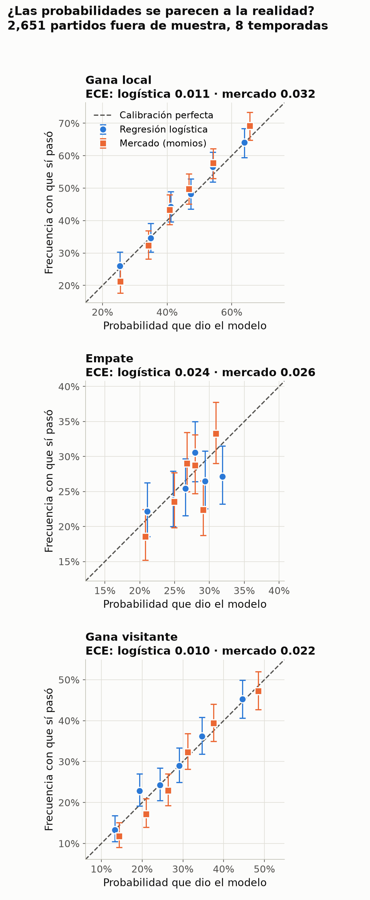

# Metodología y resultados detallados

Predictor de resultados de partidos de la **Liga MX** (gana local, empate o gana visitante) usando Elo y forma reciente, comparado contra las probabilidades implícitas de los momios del mercado. Incluye un dashboard en Streamlit.

**Demo:** [ligamx.streamlit.app](https://ligamx.streamlit.app)

> **Resultado principal:** la regresión logística le gana a no saber nada, pero **ningún modelo supera al mercado**. Agregar mis features encima de los momios empeora levemente el resultado, de forma medible (+0.0077 de log loss, IC que no cruza 0). Abajo explico por qué.

## Resultados

La evidencia principal es una validación **walk-forward**: 8 folds, una temporada de prueba cada uno (2018/19 a 2025/26, 2,651 partidos), con entrenamiento expansivo (cada fold se entrena con todas las temporadas anteriores) e hiperparámetros fijados antes de este análisis. En log loss, **menor es mejor**.

### Agregado fuera de muestra (8 folds)

| Modelo | Log loss | Accuracy |
|---|---|---|
| Mercado (momios promedio) | 1.0037 | 50.85% |
| Regresión logística + momios | 1.0115 | 50.74% |
| Regresión logística (Elo + forma) | 1.0281 | 49.30% |
| XGBoost (Elo + forma) | 1.0474 | 47.98% |
| Frecuencias históricas (baseline) | 1.0670 | 45.61% |

### Diferencia contra el mercado

Diferencia media de log loss por partido (modelo − mercado; positivo = peor que el mercado), con IC 95% por bootstrap pareado de bloques por semana calendario (10,000 remuestreos, semilla 42). La última columna es el IC simple (remuestreando partido por partido).

| Modelo | Diferencia | IC 95% por bloques | IC 95% simple |
|---|---|---|---|
| Frecuencias | +0.0633 | [0.0521, 0.0743] | [0.0524, 0.0743] |
| Regresión logística | +0.0244 | [0.0168, 0.0320] | [0.0169, 0.0321] |
| Regresión logística + momios | +0.0077 | [0.0027, 0.0127] | [0.0030, 0.0126] |
| XGBoost | +0.0437 | [0.0320, 0.0554] | [0.0327, 0.0545] |

Ningún intervalo cruza 0.

### Logística contra XGBoost y contra frecuencias

Diferencia media de log loss por partido (logística − otro modelo; negativo = la logística es mejor). Mismo bootstrap.

| Comparación | Diferencia | IC 95% por bloques | IC 95% simple | Folds que gana la logística |
|---|---|---|---|---|
| Logística vs XGBoost | −0.0193 | [−0.0283, −0.0105] | [−0.0278, −0.0108] | 6/8 |
| Logística vs frecuencias | −0.0389 | [−0.0495, −0.0280] | [−0.0499, −0.0280] | 8/8 |

**Cómo leerlo:**

- Los momios se llevan el primer lugar. Ya incorporan lesiones, alineaciones y mucha más información que la que tengo. **Ningún modelo supera al mercado**: los cuatro pierden y ningún intervalo cruza 0.
- La regresión logística supera el piso de las frecuencias históricas: gana en los 8 folds (−0.0389, IC [−0.0495, −0.0280]), así que Elo y forma reciente aportan señal. De XGBoost solo puedo decir que su log loss agregado (1.0474) es mejor que el de frecuencias (1.0670); no calculé su significancia.
- La logística le gana a XGBoost por 0.0193, con IC que no cruza 0, y gana en 6 de 8 temporadas. En el split único la diferencia era menor (~0.012) y no se calculó su intervalo; en el walk-forward sí se calculó.
- Meter Elo y forma junto con los momios empeora levemente, de forma medible (+0.0077, IC [0.0027, 0.0127]). Una posible explicación (hipótesis, no medida) es que el mercado ya incorpora la información pública que resumen Elo y forma.

### Referencia: split único (2023/24 a 2025/26)

Este es **otro experimento** (entrenamiento fijo 2013/14 a 2022/23, 1,016 partidos de prueba), por eso sus números difieren de los del walk-forward. En el walk-forward cada temporada de prueba se entrena con todas las anteriores, mientras que aquí el entrenamiento se queda fijo en 2013/14 a 2022/23.

| Modelo | Log loss | Accuracy |
|---|---|---|
| Mercado (momios promedio) | 0.9809 | 52.9% |
| Regresión logística + momios | 0.9879 | 52.0% |
| Regresión logística (Elo + forma) | 1.0090 | 50.5% |
| XGBoost (Elo + forma) | 1.0213 | 50.2% |
| Frecuencias históricas (baseline) | 1.0599 | 47.1% |

En este split las frecuencias predicen 44.6% local, 27.1% empate y 28.3% visitante.

## Calibración



Un modelo está **calibrado** si, cuando dice "40%", ese resultado pasa más o menos el 40% de las veces. En la gráfica, cada punto agrupa ~440 partidos con probabilidades parecidas y la línea punteada es la calibración perfecta: un punto sobre la línea es honesto, uno arriba dice menos de lo que pasa y uno abajo dice más. Se midió con las mismas predicciones fuera de muestra del walk-forward (2,651 partidos), con 6 grupos de igual tamaño por resultado.

**Calibración no es lo mismo que acierto.** En la logística no se detecta descalibración (sus ECE de local y visitante caen dentro del ruido), pero el mercado la supera en Brier (el error cuadrático de las probabilidades; menor es mejor) y en log loss. En Brier la diferencia por partido, logística − mercado, es +0.0166 con IC 95% por bloques de semana [0.0115, 0.0218] (IC simple [0.0115, 0.0219]): no cruza 0, así que el mercado supera a la logística en Brier.

| Fuente | Brier total (suma de los 3 resultados) |
|---|---|
| Mercado | 0.6002 |
| Regresión logística | 0.6168 |

**ECE** (error de calibración esperado: qué tanto se aleja, en promedio, la probabilidad dicha de la frecuencia real). Un modelo perfecto tampoco da 0 con ~440 partidos por grupo, por el ruido de la muestra, así que se compara contra el ECE que daría un modelo perfecto (simulando los resultados con las propias probabilidades, 1,000 simulaciones; límite = percentil 97.5):

| Fuente | Resultado | ECE | Esperado si fuera perfecto | Límite del ruido |
|---|---|---|---|---|
| Logística | Gana local | 0.0108 | 0.0180 | 0.0293 |
| Logística | Empate | 0.0236 | 0.0166 | 0.0274 |
| Logística | Gana visitante | 0.0098 | 0.0165 | 0.0274 |
| Mercado | Gana local | 0.0324 | 0.0181 | 0.0302 |
| Mercado | Empate | 0.0262 | 0.0166 | 0.0279 |
| Mercado | Gana visitante | 0.0221 | 0.0167 | 0.0272 |

No publico intervalos de confianza del ECE: el bootstrap les mete ruido adicional y salen inflados hacia arriba, así que no son confiables.

**Sensibilidad al número de grupos (4, 6 y 10):**

- La única conclusión estable es que el **mercado queda descalibrado en "gana local"**: Ningún grupo por sí solo se distingue de la línea (la barra de error de cada uno la toca), pero el patrón sí: los grupos de favoritos quedan sistemáticamente por encima (en el más alto el mercado dice 65.3% y el local ganó 69.2%), y eso deja el ECE sobre el límite del ruido con 4, 6 y 10 grupos.
- El **empate de la logística** solo pasa el límite del ruido con 4 grupos (con 6 y 10 no), así que no lo afirmo como descalibración.
- El visitante del mercado solo pasa el límite con 10 grupos, tampoco es estable.
- Local y visitante de la logística nunca pasan el límite.

**No se aplicó ninguna recalibración.** En local y visitante la logística ya está dentro del ruido, y la señal del empate no es robusta al número de grupos, así que no había algo sólido que corregir.

**Limitación (hipótesis, no resultado):** las probabilidades del mercado salen de dividir los momios entre su suma, que supone que el margen de la casa se reparte de forma proporcional. Si no es así, esa conversión podría sesgar sus probabilidades y contribuir a la descalibración que se ve en "gana local". No lo probé.

## Datos

- Resultados y momios de [football-data.co.uk](https://football-data.co.uk/mexico.php) (`MEX.csv`): 4,743 partidos de 2012/13 a 2026/27 (torneo en curso).
- Baseline del mercado: promedio de momios de cierre (`AvgCH`, `AvgCD`, `AvgCA`), convertidos a probabilidades quitando el margen de la casa. Es la única fuente de momios completa para todos los partidos.
- El CSV no trae tiros ni posesión. Eso es bueno: esas estadísticas solo se conocen después del partido y serían fuga de datos.

## Metodología

- **Elo:** todos los equipos inician en 1500 y el rating se actualiza después de cada partido (K = 20, ventaja de local = 60).
- **Forma reciente:** puntos, goles a favor y goles en contra de los últimos 5 partidos, calculados solo con partidos anteriores.
- **Validación temporal:** nunca se mezclan partidos del futuro con el pasado. La temporada 2012/13 solo calienta el Elo y la 2026/27, al estar en curso, queda fuera.
- **Walk-forward (evidencia principal):** un fold por temporada de 2018/19 a 2025/26. Cada fold se entrena con todas las temporadas anteriores (desde 2013/14) y se prueba en esa temporada. Elo y forma se calculan una sola vez sobre toda la historia en orden cronológico; no hay fuga porque cada feature usa solo partidos anteriores, y lo único que cambia por fold es el ajuste del modelo. Los hiperparámetros están fijos y no se afinan con los folds.
- **Intervalos de confianza:** bootstrap pareado de la diferencia de log loss por partido contra el mercado, remuestreando bloques de una semana calendario (aproximación de jornada, porque los partidos de una misma semana no son independientes), 10,000 remuestreos y semilla 42. El IC simple, partido por partido, coincide con el de bloques (difieren en 0.001 o menos), así que la conclusión no depende del método.
- **Split único (referencia):** entrenamiento 2013/14 a 2022/23, prueba 2023/24 a 2025/26.
- **Afinación del Elo:** rejilla de 48 combinaciones (K, ventaja de local, regresión a la media entre torneos) validada en 2021/22 y 2022/23. Las diferencias entre las mejores fueron de ~0.0004 en log loss, o sea ruido, así que se conservaron los valores originales. Esas dos temporadas también son folds del walk-forward (marcados con * en la salida de `src/evaluacion.py`), así que no son 100% limpios, aunque el efecto es despreciable.

## Limitaciones

- No hay datos de lesiones, alineaciones ni calendario. Por eso no se puede esperar superar al mercado.
- La temporada 2019/20 está incompleta (el Clausura 2020 se canceló por COVID).
- Los torneos cortos (17 jornadas) hacen que la forma reciente sea ruidosa.
- El modelo del dashboard se entrena con todos los partidos disponibles. Las métricas de las tablas vienen de la evaluación temporal (walk-forward y split único), no del modelo final.
- Es un proyecto educativo, **no** una recomendación de apuestas.

## Cómo correrlo

Solo la app (el modelo ya viene en el repo):

```bash
git clone https://github.com/luismtz224/ligamx-match-predictor.git
cd ligamx-match-predictor
python -m venv .venv
source .venv/Scripts/activate   # Windows con Git Bash. En Linux/macOS: source .venv/bin/activate
pip install -r requirements.txt
streamlit run app.py
```

Para la app basta `requirements.txt`. Para el notebook, reentrenar el modelo y las pruebas, instala `requirements-dev.txt` (incluye al anterior):

```bash
pip install -r requirements-dev.txt
python -m src.entrenar    # tabla del split único y regenera modelos/modelo.joblib
python -m src.evaluacion  # walk-forward con intervalos de confianza por bootstrap
python -m src.calibracion # curvas de calibración, Brier y ECE; genera calibracion.png
python -m pytest -q       # pruebas de Elo, forma, no-fuga de datos, folds y calibración
```

El CSV ya viene en `datos/crudos/`. Si quieres actualizarlo con los partidos más recientes, descarga [MEX.csv](https://football-data.co.uk/new/MEX.csv) y reemplázalo (si `curl` da error de certificado, bájalo desde el navegador). El análisis completo está en `cuadernos/01_exploracion.ipynb`.

## Estructura

```
├── app.py                  # dashboard de Streamlit
├── cuadernos/
│   └── 01_exploracion.ipynb  # datos, features, modelos y evaluación
├── datos/
│   ├── crudos/             # MEX.csv original
│   └── procesados/         # partidos con features (no se sube)
├── modelos/modelo.joblib   # modelo entrenado
├── src/                    # features.py (Elo y forma), entrenar.py, evaluacion.py (walk-forward) y calibracion.py
├── tests/                  # test_features.py (Elo, no-fuga), test_evaluacion.py (folds, bootstrap) y test_calibracion.py
├── requirements.txt        # solo lo que necesita la app
└── requirements-dev.txt    # notebook, entrenamiento y pruebas
```

## Stack

Python, pandas, scikit-learn, XGBoost (solo para entrenamiento y comparación), Streamlit.

## Autor

Luis ([@luismtz224](https://github.com/luismtz224)). Licencia MIT.
